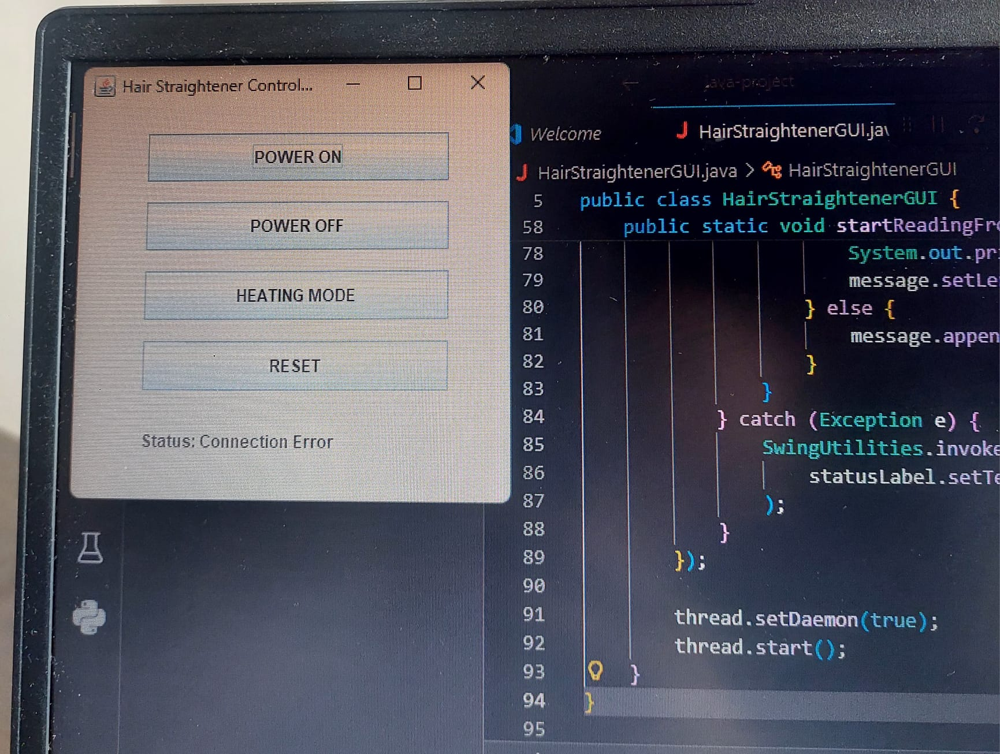

# Smart Hair Straightener Control System

## 📌 Project Overview
This project is a Java Swing + Arduino based system that simulates a smart hair straightener control device.

The Java desktop application communicates with Arduino via USB Serial (COM port) and allows the user to control the state of a hair straightener.

The system demonstrates a clear visible effect using an LED:
- Power ON/OFF state
- Heating mode status

Arduino sends status messages back to the GUI, and the GUI displays these messages in real-time.

---

## 🎯 Purpose
The purpose of this project is to simulate a real-life hair straightener control system and demonstrate communication between software (Java GUI) and hardware (Arduino).

It allows:
- Remote control of device states (power & heating)
- Real-time feedback from hardware to GUI
- Safe and simple interaction with an electrical device

---

## ⚙️ Technologies Used
- Java (Swing GUI)
- Arduino (C/C++)
- Serial Communication (USB / COM Port)

---

## 🔌 Hardware Components
- Arduino Uno  
- LED (represents hair straightener state)  
- Resistor  
- USB Cable  

---

## 🧠 System Functionality

### GUI Features
- Connects to Arduino via COM port  
- POWER ON button  
- POWER OFF button  
- HEATING MODE button  
- RESET button  
- Displays status messages from Arduino  

### Arduino Features
- Receives commands from Java  
- Controls LED accordingly  
- Sends status messages back to Java  

---

## 🔄 Communication Protocol

### Commands (Java → Arduino)
| Command | Meaning |
|--------|--------|
| 1 | Power ON |
| 2 | Power OFF |
| 3 | Heating Mode |
| 4 | Reset |

### Responses (Arduino → Java)
- "POWER ON"  
- "POWER OFF"  
- "HEATING MODE"  
- "RESET"  

---

## ▶️ How to Run

### 1. Arduino Setup
1. Open Arduino IDE  
2. Open `hair_straightener_control.ino`  
3. Select the correct board and COM port  
4. Upload the code to Arduino  

### 2. Java Application
1. Open the project in an IDE (IntelliJ / Eclipse)  
2. Run `HairStraightenerGUI.java`  
3. Select the correct COM port in the GUI  
4. Use the buttons  

---

## 🖥️ GUI Screenshot


---

## ✅ Requirements Checklist
✔ Java GUI sends commands to Arduino via USB Serial  
✔ Arduino responds with status messages  
✔ Visible effect (LED ON/OFF)  
✔ At least two GUI controls (buttons)  
✔ GUI displays incoming data  
✔ Communication protocol is documented  
✔ GitHub repository includes code and README  

---

## 🚀 Conclusion
This project successfully simulates a smart hair straightener control system using a Java GUI and Arduino.

Users can control the device (power and heating mode) through the interface, and the LED provides a clear visual representation of the device state. The system also supports real-time feedback from Arduino, making it a complete and interactive hardware-software application.

---

## 📁 Project Structure
```
.
├── HairStraightenerGUI.java
├── hair_straightener_control.ino
├── gui.png
└── README.md
```
