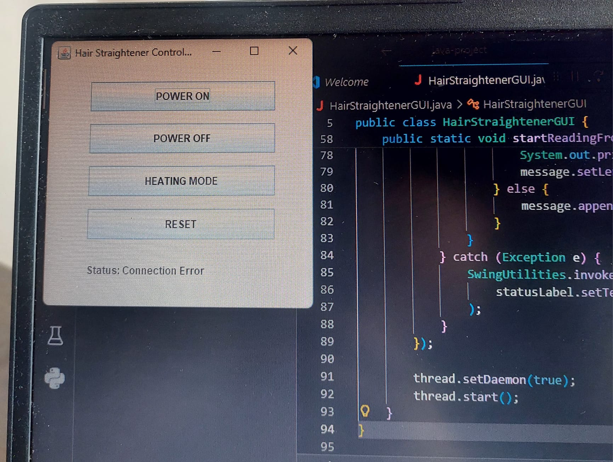

Smart Hair Straightener Control System

📌 Description

This project is a smart hair straightener control system developed using Java Swing GUI and Arduino. It allows users to control the device and receive real-time feedback through serial communication.

---

🛠 Technologies Used

- Java (Swing GUI)
- Arduino
- Serial Communication (USB / COM Port)

---

⚙️ Features

- Power ON → LED turns ON
- Power OFF → LED turns OFF
- Heating Mode → LED blinks
- Reset → LED turns OFF
- Real-time status feedback displayed in GUI

---

🔌 Hardware Setup

- Arduino Uno
- LED
- Resistor (220Ω)
- USB Cable

---

▶️ How to Run

1. Connect Arduino to the computer via USB
2. Upload the Arduino code using Arduino IDE
3. Close Arduino IDE
4. Run the Java application
5. Select the correct COM port
6. Use the GUI buttons to control the system

---

📡 Communication Protocol

Commands (Java → Arduino)

- "1" → POWER ON
- "2" → POWER OFF
- "3" → HEATING MODE
- "4" → RESET

Responses (Arduino → Java)

- "POWER ON"
- "POWER OFF"
- "HEATING MODE"
- "RESET"

---

🖥 GUI Screenshot

---

🎯 Purpose

This project simulates a smart hair straightener control system using bidirectional communication between Java GUI and Arduino.
